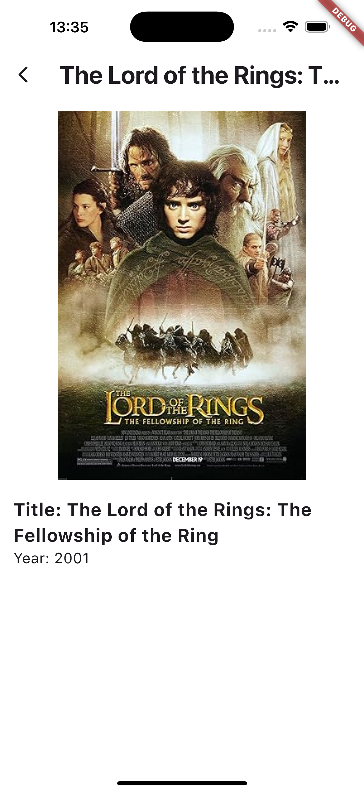
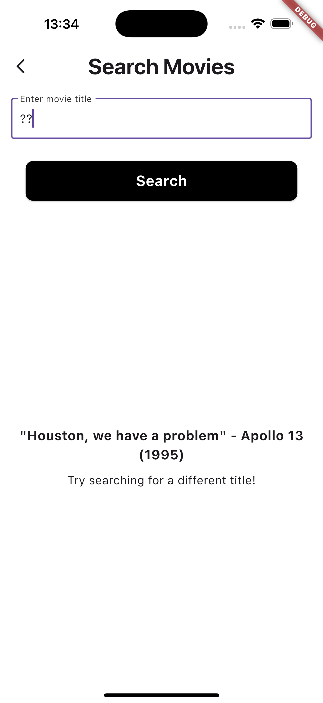
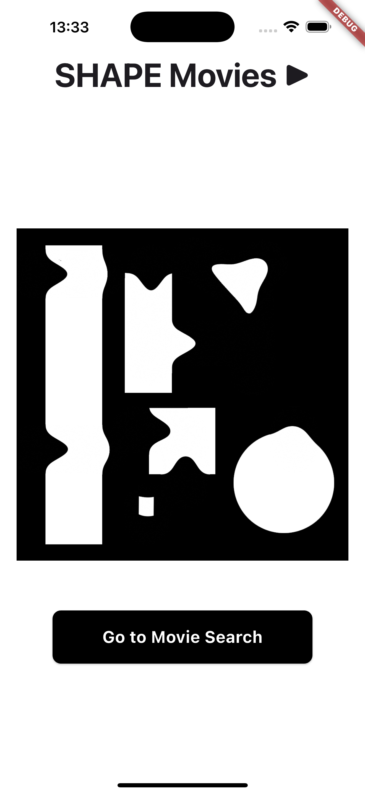

# OMDB_API_UPDATED

Shape Software Developer Apprenticeship Task - UPDATED

This is my updated version of an OMDB API App in flutter.

## Introduction

I really enjoyed the task, but those 6 hours flew by, so I have decided to try and update the version I uploaded. 

So far I absolutely love the inline parameter descriptions it gives, it makes finding your way around so much easier.

Also the automatic refactoring has saved me a lot of time already, when moving screens between folders it automatically changed pathing inside of files - so handy.

## UPDATED Features

### Additional "Movie Details" screen- 

- Users can now get a better look at poster and movie details, I intend to also pull a short plot from the OMDB API.

### Error Handling - 

- Added movie quotes rather than the basic error handling instructions - "try again" etc

### Improved UI & Logo

- New colour palette, bolder App Bar titles, more visually appealing buttons.
- New App name "SHAPE Movies".
- New logo matching the colour theme and fitting the brand name.
- Decided against the image carousel on the homepage
- I used an APP Icon creator website to resize all of my images, but have since found that there is a better way to do it. (https://pub.dev/packages/flutter_launcher_icons)

### Themes & Screens Folders

- Themes now consistent and all handled from one theme.dart file, within a themes folder
- screens folder now contains all screens (can I just say how great the automatic refactoring is)

## TO DO

- Add "Plot" to Movie Details screen
- Search Filtering 

## Final Notes

While still rough, I am happy with the progress I've made. Depending on sources I have been reading, there seems to be different ideas of what constitutes "best practice" so I may have missed the mark in a few areas. Most notably with theme data - it did seem strange to be applying graphical changes inside the widget trees, but I have changed that to a new folder system and seperate theme.dart file.

Also my comments are still a bit all over the place, but have been invaluable to me in terms of keeping track of where I am and what I still need to research - when I first left most of them I was very aware of having limited time so I just rushed to type them.

After having more time to work within Flutter, I've realised I may have referred interchangebly between Flutter and Dart in my 6 hour task - the more I've read up on it and worked on it I now know Flutter is the framework, within which Dart is the programming language.

